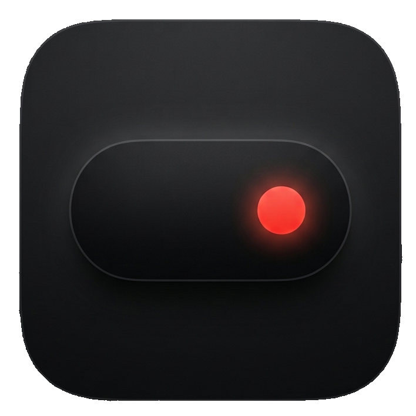

  

<h1 align="center">Velo</h1>

  Free desktop screen recorder with a clean, modern interface built for fast, effortless capture.

  
  
  
  

---

## What is Velo?

Velo is a free desktop screen recording app designed for fast, effortless capture without a complicated workflow.
It provides a clean and modern interface with essential controls always within reach — including source selection, system audio, microphone input, and recording status.

## Features

- 🖥️ Record full screen or a specific window
- 🔊 System audio capture
- 🎙️ Microphone input support
- ⚡ Fast setup with no learning curve
- 🎨 Clean and minimal interface

## Download

| Platform | Status |
|---|---|
| Linux (.deb) | ✅ Available |
| Linux (.rpm) | ✅ Available |
| Windows | 🔜 Coming soon |
| macOS | 🔜 Coming soon |

→ [Download latest release](https://github.com/gabridevapp/velo/releases)

## Built with

- [Tauri v2](https://tauri.app)
- Rust
- HTML / CSS / JavaScript

## License

MIT
